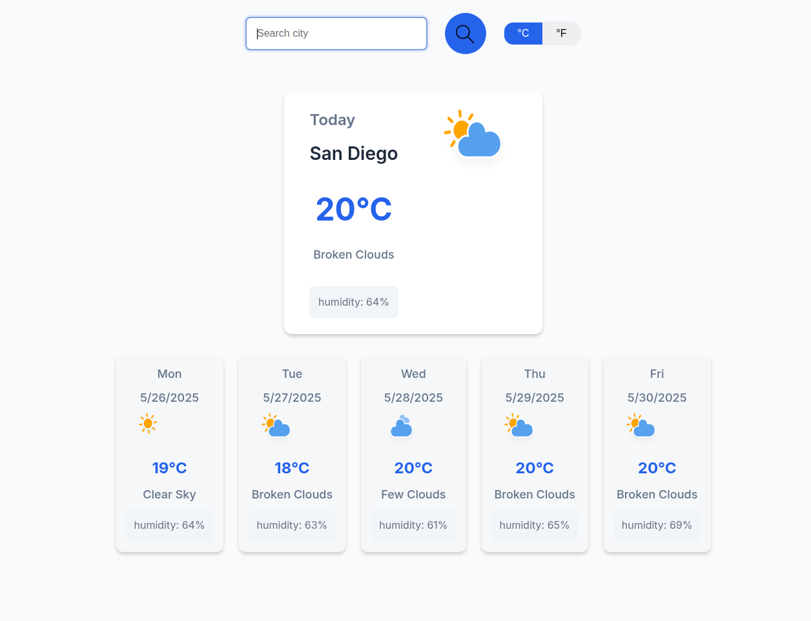

# Weather App

A sleek, responsive weather application that allows users to check current weather conditions for any city around the world.



## Features

- **Real-time Weather Data**: Fetches current weather information from OpenWeatherMap API
- **City Search**: Look up weather by city name
- **Weather Details**: View temperature, weather description, humidity, and more
- **Temperature Units**: Toggle between Celsius and Fahrenheit with smooth animation
- **Weather Icons**: Dynamic icons that represent current weather conditions
- **Responsive Design**: Optimized for all device sizes from mobile to desktop
- **Loading States**: Visual feedback while weather data is being fetched
- **Error Handling**: User-friendly error messages for various edge cases

## Technologies Used

- **JavaScript (ES6+)**: Modern JS with classes and modules
- **CSS3**: Custom styling with animations and responsive design
- **HTML5**: Semantic markup
- **Fetch API**: For making API requests
- **OpenWeatherMap API**: Weather data source
- **Custom SVG Icons**: For weather visualization

## Project Structure

The project follows a modular architecture with clear separation of concerns:

weather-app/
├── EXPLORER
├── WEATHER-APP
│   ├── assets/
│   │   └── *.svg         # Weather and UI icons
│   ├── images/
│   │   └── WeatherAppS... # App screenshot
│   ├── modules/
│   │   ├── ui/
│   │   │   ├── SearchForm.js
│   │   │   └── WeatherDisplay.js
│   │   ├── WeatherData.js
│   │   └── WeatherService.js
│   ├── app.js
│   ├── index.html
│   ├── README.md
│   └── style.css


## How It Works

1. **User Input**: Enter a city name in the search box
2. **Data Fetching**: The app fetches weather data from OpenWeatherMap
3. **Data Processing**: Raw data is transformed into a clean format
4. **Display**: Weather information is presented with appropriate icons
5. **Unit Toggle**: Click °C/°F buttons to switch temperature units

## Code Features

- **ES6 Modules**: Clean code organization with import/export
- **Async/Await**: Modern approach to handling asynchronous operations
- **Custom Events**: Event-driven architecture for component communication
- **Error Handling**: Comprehensive error catching and user feedback
- **Loading States**: Visual indicators during API calls

## Installation

1. Clone the repository:
   ```
   git clone https://github.com/BeTous8/Weather-App.git
   ```

2. Navigate to the project directory:
   ```
   cd Weather-App
   ```

3. Open `index.html` in your browser to run the application.


## API Key Setup

To use this application, you'll need an API key from OpenWeatherMap:

1. Sign up at [OpenWeatherMap](https://openweathermap.org/api)
2. Generate an API key
3. Replace the placeholder API key in `WeatherService.js`:
   ```javascript
   static API_KEY = 'your-api-key-here';
   ```

## Future Enhancements

- Weather forecast for upcoming days
- Geolocation support to get local weather
- More detailed weather information
- Weather maps integration
- Saving favorite locations

## Credits

- Weather data provided by [OpenWeatherMap](https://openweathermap.org/)
- Weather icons from [Weather Icons](https://erikflowers.github.io/weather-icons/)
- Project created as part of [The Odin Project](https://www.theodinproject.com/) curriculum
